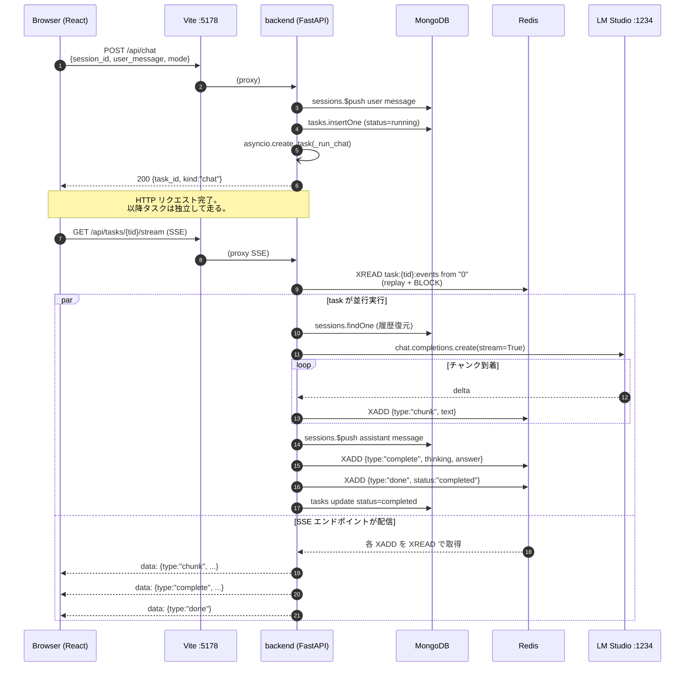
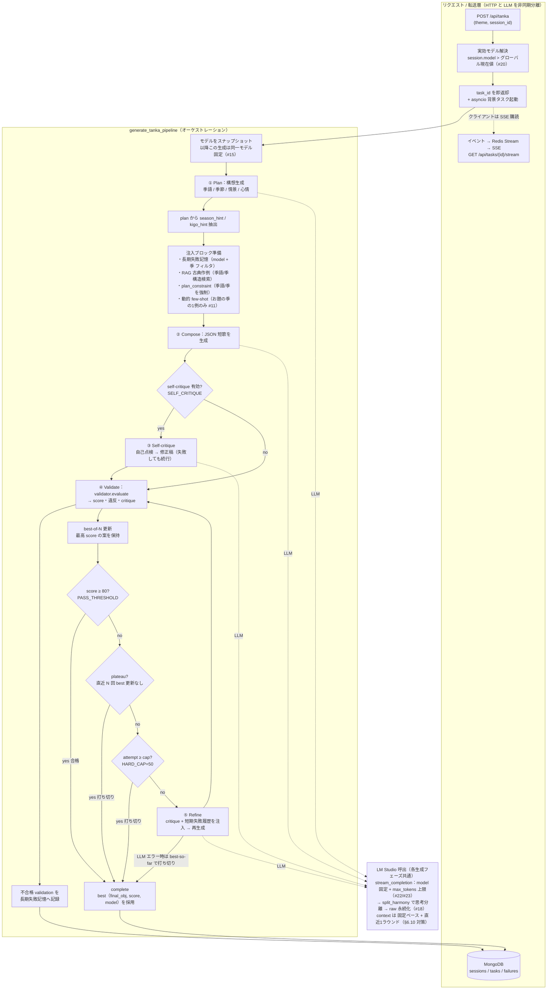
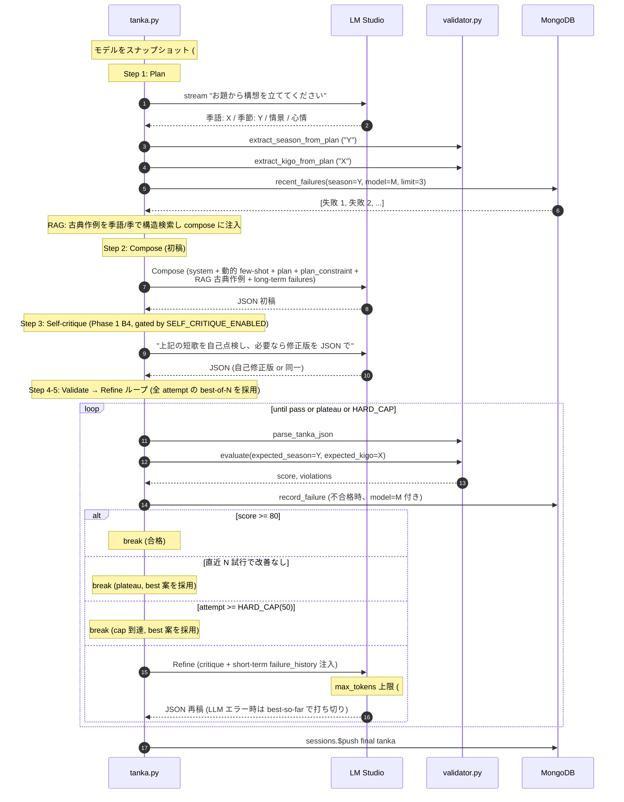
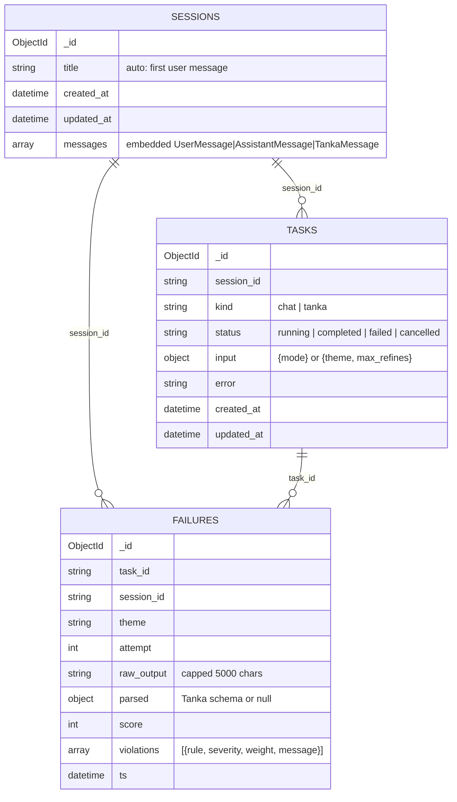

# Tanka Chat — 開発アーキテクチャ

ローカル LLM (LM Studio + `llm-jp-4-8b-thinking`) を使った短歌生成チャット。
構造化検証・採点・改稿ループ・長期失敗記憶を備えた、Docker ベースの個人向け Web アプリ。

このドキュメントは **開発者間の情報共有** を目的としています。
コード変更時はこのドキュメントも更新してください。

> **引き継ぎ担当者へ**: コードからは読み取りにくい LLM フィードバック設計の意図は
> [`feedback-architecture.md`](feedback-architecture.md) に集約しています。**先にそちらを読むこと**。
> このファイルはシステム構造の地図、`feedback-architecture.md` は設計思想と「やってはいけないこと」のガイドです。

---

## 1. システム全体図

```
┌─ Host (developer machine) ─────────────────────────────────────┐
│                                                                │
│  LM Studio (OpenAI 互換 REST :1234)                            │
│      ▲                                                         │
│      │ host.docker.internal:1234                               │
│      │                                                         │
│  ┌───┴─────────────── Docker network ───────────────────────┐  │
│  │                                                          │  │
│  │  ┌──────────────┐    /api/* (Vite proxy)                 │  │
│  │  │ frontend     │─────────┐                              │  │
│  │  │ Vite :5178   │         │                              │  │
│  │  │ React 18     │         ▼                              │  │
│  │  └──────────────┘    ┌─────────────────┐                 │  │
│  │                      │ backend         │                 │  │
│  │   browser ──────────▶│ FastAPI :8001   │                 │  │
│  │   (host)             │ uvicorn + uv    │                 │  │
│  │                      └────┬───────┬────┘                 │  │
│  │                           │       │                      │  │
│  │             ┌─────────────┘       └───────────┐          │  │
│  │             ▼                                 ▼          │  │
│  │   ┌──────────────────┐              ┌──────────────────┐ │  │
│  │   │ mongo            │              │ redis            │ │  │
│  │   │ mongo:8.0 :27017 │              │ redis:7 :6379    │ │  │
│  │   │ Persistent state │              │ Task event bus   │ │  │
│  │   └──────────────────┘              └──────────────────┘ │  │
│  │     volume mongo_data                 (ephemeral)        │  │
│  └──────────────────────────────────────────────────────────┘  │
└────────────────────────────────────────────────────────────────┘
```

### サービス役割

| Service  | Image           | Port  | Volume         | 責務 |
|----------|-----------------|-------|----------------|------|
| frontend | `node:20-alpine` (dev) | 5178 | bind `./frontend`, named `frontend_node_modules` | React + Vite dev server。`/api/*` を backend へ proxy |
| backend  | `python:3.12-slim` + uv | 8001 | bind `./backend`, named `backend_venv` | FastAPI。SSE 配信、LM Studio 呼び出し、永続化、タスク管理 |
| mongo    | `mongo:8.0` (公式 latest GA) | 27017 | named `mongo_data` | sessions / tasks / failures コレクション |
| redis    | `redis:7-alpine` | 6379 | (なし) | タスクイベントブローカ (Streams `task:{id}:events`) |

LM Studio は **Docker の外** でホストに立てる前提。`host.docker.internal:host-gateway` を `extra_hosts` で渡しているので Linux / macOS どちらでも到達可能。

---

## 2. バックエンドのモジュール構成

```
┌─────────────────────────────────────────────────────────────┐
│                     main.py (FastAPI)                       │
│  - HTTP ルート定義のみの薄いレイヤ                          │
│  - lifespan (起動/graceful shutdown)                         │
└───┬──────────────────────────────────────────────┬──────────┘
    │                                              │
    ▼                                              ▼
┌────────────────────┐                  ┌─────────────────────┐
│ tasks.py            │                  │ db.py                │
│ - asyncio タスク管理 │                  │ - MongoDB CRUD       │
│ - 起動 / cancel     │                  │ - serialize          │
│ - イベント emit     │                  │ - 失敗記録 / pruning │
└──┬────────────┬────┘                  └──────────────────────┘
   │            │                                  ▲
   │            └─────────────────────┐            │
   ▼                                  ▼            │
┌──────────────────┐         ┌──────────────────┐  │
│ tanka.py         │         │ bus.py           │  │
│ - LLM パイプライン │         │ - Redis Streams  │  │
│ - Plan → Compose │         │ - XADD / XREAD   │  │
│   → Validate     │         │ - TTL 管理       │  │
│   → Refine       │         └──────────────────┘  │
└────┬─────────────┘                                │
     │                                              │
     ▼                                              │
┌──────────────────┐                                │
│ validator.py     │                                │
│ - Pydantic Tanka │                                │
│ - 9 ルール       │                                │
│ - スコアリング   │                                │
│ - critique 整形  │                                │
└────┬─────────────┘                                │
     │                                              │
     ▼                                              │
┌──────────────────┐                                │
│ data/kigo.json   │                                │
│ 226 季語         │                                │
└──────────────────┘                                │
                                                    │
                                            ┌───────┘
                                            │
                                     (failure injection)
```

**設計指針**:

- **`main.py` は thin HTTP layer**。ロジックを書かず、リクエスト検証 → 適切な層に委譲のみ。
- **`tanka.py` は DB を知らない** 純粋なパイプライン。`db` の import は遅延 import で循環参照を避けつつ、長期失敗記憶の取得のみに留める。
- **`validator.py` は副作用なし**。Pydantic スキーマ + ルール関数群 + スコア計算のみ。
- **`bus.py`** は Redis 操作の唯一の窓口 (テストで差し替え可能なように)。
- **`tasks.py` は orchestrator**。pipeline からの event を受け、Redis に流し、DB に永続化し、長期失敗記憶を記録する。

---

## 3. 主要なデータフロー

### 3.1 通常チャット



**ポイント**:

- POST /api/chat は **task_id を返して即 close**。LLM 呼び出しの寿命とは独立。
- フロントは `/api/tasks/{tid}/stream` を SSE 購読する 2 段階。
- セッション切替で SSE を切っても、バックエンドの asyncio タスクは生き続け、最後まで走り切る。
- 再接続時は `XREAD ... from "0"` で **頭から replay**。途中切断・タブ閉じからの復帰も同じイベントが再生される。

### 3.2 短歌パイプライン

**制御フロー鳥瞰（現行）** — 終了条件・分岐・横断する仕組みを示す。詳細な実装は `tanka.py` の
`generate_tanka_pipeline`:



**参加者間シーケンス** — 誰が誰を呼ぶか（同じ流れを interaction 視点で）:



**Plan→Compose の整合性保証 (重要)**:

8B モデルは Plan で決めた季節/季語を Compose で勝手に変える失敗をしがち。
`season_matches_plan` (-30 critical) / `kigo_matches_plan` (-20 major) ルールで強制的に refine ループに戻し、
さらに Compose プロンプトには Plan から抽出した値を `【重要・必須】season は "夏" / kigo は "蝉"` として明示注入。

---

## 4. データモデル

### 4.1 MongoDB



**Embedded messages のシェイプ** (sessions.messages):

```python
# user
{kind:"user", content:str, created_at:datetime}

# assistant (chat)
{kind:"assistant", content:str, thinking:str|None, created_at:datetime,
 cancelled:bool?}  # 中断時のみ

# tanka (短歌パイプライン完了時の永続化)
{kind:"tanka", theme:str, plan:str, tanka:str, moras:[int],
 kigo:str, season:str, image:str, emotion:str, final_score:int,
 validations:[{attempt, score, errors, warnings, violations, resolved}],
 max_refines_reached:bool, plateau_reached:bool, best_score:int?,
 score_history:[int]?, created_at:datetime}
```

### 4.2 Redis Streams

```
Key:    task:{task_id}:events
Type:   STREAM
TTL:    3600s    (タスク完了後に EXPIRE; 再接続猶予)
MAXLEN: 10000    (approximate, 暴走防止)

Entry data fields (JSON encoded into single "data" field):
  {type:"chunk", text:"..."}
  {type:"chunk", phase:"plan", text:"..."}      # tanka pipeline 中
  {type:"phase_start", phase:"compose"}
  {type:"phase_end", phase:"compose", text:"..."}
  {type:"validation", attempt:0, score:65, ...}
  {type:"complete", tanka:"...", score:88, ...}
  {type:"plateau_reached", best_score:75, history:[...]}
  {type:"cancelled"}
  {type:"error", message:"..."}
  {type:"done", status:"completed"}
```

SSE 配信側は `XREAD BLOCK 5000 STREAMS task:{tid}:events 0-0` で頭から購読し、`done` を受けて終了。
タイムアウト時は DB の `tasks.status` を確認して、`completed/failed/cancelled` なら強制終了 (孤児防御)。

---

## 5. SSE イベントプロトコル

### `POST /api/chat` → `GET /api/tasks/{tid}/stream`

| event type | フィールド | 説明 |
|---|---|---|
| `task_meta` | task_id, kind, session_id, status | 接続直後の初期情報 |
| `chunk` | text | LLM の生 delta (harmony 制御トークン含む) |
| `complete` | thinking, answer | 整形後の最終 (harmony を分離済) |
| `cancelled` | — | ユーザー cancel 完了 |
| `error` | message | パイプライン内例外 |
| `done` | status | ストリーム終了マーカー |

### `POST /api/tanka` → `GET /api/tasks/{tid}/stream`

| event type | フィールド | 説明 |
|---|---|---|
| `task_meta` | task_id, kind, session_id, status | 接続直後の初期情報 |
| `phase_start` | phase ("plan"\|"compose"\|"self_critique"\|"refine"), attempt? | フェーズ開始 |
| `chunk` | phase, attempt?, text | LLM 生 delta (フェーズタグ付き) |
| `phase_end` | phase, attempt?, text, duration_seconds | フェーズ完了 (整形後本文 + 所要秒 #27) |
| `validation` | attempt, score, errors, warnings, violations, resolved | 検証結果 |
| `plateau_reached` | best_score, history | 改善なしで打ち切り |
| `max_refines_reached` | best_score | HARD_CAP=50 到達 (稀) |
| `complete` | tanka, plan, moras, kigo, season, image, emotion, score | 最終結果 |
| `cancelled` / `error` | 同上 | |
| `done` | status, duration_seconds? | 終了マーカー + 全体所要秒 (#27)。complete より後に流れるため、ライブ UI は done で完成ブロックに所要を後付けする |

フロント (`api.js` の `streamTask`) は POST 不可制約を回避するため、`EventSource` ではなく `fetch + ReadableStream` で手動 SSE パース。

---

## 6. 品質保証層 (validator)

```
INPUT (LLM 生出力)
     │
     ▼
parse_tanka_json (code fence / 前後散文を剥がす + JSON.loads)
     │
     ▼ Pydantic Tanka model_validate
     │
     ▼
RULES (副作用なしの check 関数群)
   ├─ _rule_mora_count           critical -10  拍数 5-7-5-7-7
   ├─ _rule_mora_count_disputed  minor    -3   pykakasi だけ違う (古典読み)
   ├─ _rule_kigo_present         critical -25  宣言季語が本文に出るか
   ├─ _rule_kigo_unique          major    -15  ちょうど 1 回か
   ├─ _rule_kigo_in_dictionary   minor    -5   歳時記辞書に登録あるか
   ├─ _rule_season_consistent    major    -20  宣言季 == 辞書記載季
   ├─ _rule_no_other_kigo        critical -30/-25  宣言外季語の混入 (季違い/季重なり、両方禁止)
   └─ _rule_repeated_word        minor    -3   3+ 文字の重複表現
     │
     ▼
PLAN-AWARE RULES (evaluate() の引数経由)
   ├─ season_matches_plan        critical -30  Plan の季節と一致
   └─ kigo_matches_plan          major    -20  Plan の季語と一致
     │
     ▼
score = max(0, 100 - sum(weights))
passed = (score >= PASS_THRESHOLD=80)
     │
     ▼
format_critique → refine プロンプトの user 部分に投入
```

### 改稿ループの停止条件

```
合格         score >= 80                      → 即終了 (該当 attempt を最終結果)
plateau     直近 3 試行で best_score 更新なし   → 打ち切り、過去最高の attempt を採用
hard cap    attempt >= HARD_CAP (=50)         → 打ち切り (安全網; 通常踏まない)
llm_error   refine 中の LLM 例外/context 超過   → best-so-far で打ち切り (fail-clean; #22/#23 の上限とペア)
cancel      asyncio.Task.cancel()             → partial を保存して終了
```

### 長期失敗記憶 (Phase 6)

```
[Compose 直前]
   ↓
recent_failures(season=plan_season, limit=3)
   ↓
format_long_term_failures()
   ↓
"【長期失敗記憶 — 過去にやらかした違反パターン】
   失敗 1: お題「夏の夜」(宣言季語「蛍」) で score=65 → 教訓: ..."
   ↓
Compose プロンプトに挿入
```

各 attempt の不合格 (`resolved=False`) で `db.record_failure(...)`。
`_prune_failures(max_count=1000)` で FIFO 上限管理。

---

## 7. リポジトリ構成

```
app/
├── README.md                  起動方法 + アーキ概要
├── docker-compose.yml         4 サービスの orchestration
├── start.sh                   1 コマンド起動 + 2 段階 Ctrl-C
├── docs/
│   └── architecture.md        ← このファイル
│
├── backend/
│   ├── Dockerfile
│   ├── .dockerignore
│   ├── pyproject.toml         fastapi / uvicorn / openai / pykakasi / pymongo / redis
│   ├── main.py                FastAPI app, ルート定義
│   ├── tasks.py               asyncio task lifecycle, cancel, partial-save
│   ├── tanka.py               Plan → Compose → Validate → Refine パイプライン
│   ├── validator.py           Pydantic Tanka + ルール + スコアリング + 教訓化
│   ├── db.py                  MongoDB CRUD (sessions / tasks / failures)
│   ├── bus.py                 Redis Streams 操作 (XADD, XREAD, EXPIRE)
│   └── data/
│       └── kigo.json          226 季語 × 5 季
│
└── frontend/
    ├── Dockerfile
    ├── .dockerignore
    ├── package.json           react / vite / marked
    ├── vite.config.js         /api → BACKEND_URL or localhost:8001
    ├── index.html
    └── src/
        ├── main.jsx           React root + ErrorBoundary
        ├── App.jsx            UI: sessions sidebar, streaming, validation panel, failures modal
        ├── api.js             SSE client (fetch + ReadableStream + harmony split)
        └── styles.css         スタイル一式
```

---

## 8. 設計判断の "なぜ"

| 採用したもの | 採用しなかったもの | 理由 |
|---|---|---|
| Redis **Streams** (XADD/XREAD) | Pub/Sub | replay 可能。SSE 再接続時の頭出しに必要 |
| FastAPI **lifespan** で graceful shutdown | atexit / signal handler | uvicorn の wait_for_shutdown と組み合わせて任意時間の cleanup ができる |
| LLM 出力を **JSON 強制** | 自由テキスト + パターン抽出 | Pydantic で型検証でき、検証ルールが書きやすい |
| **Plateau 検知** | 固定回数 (`max_refines=3`) | 簡単に解けるものは 1 回、難しいものは何度でも試せる |
| 全 attempt の **best score を最終採用** | 最後の attempt を採用 | 改善が単調でない場合の保険 |
| **歳時記辞書** をハンドキュレートで JSON | MeCab + IPADic + 季語タグ | 依存追加なし、必要十分な範囲をカバー |
| **モデル提供読み vs pykakasi の食い違いを minor 扱い** | 厳格 critical 扱い | 古典読み (春の日に → はるのひに) で誤判定を防ぐ |
| **Plan-Compose 整合の validator ルール** | プロンプトで願う | 8B モデルの指示追従は不安定なので、出口で検証する方が確実 |
| **長期失敗記憶を季節でフィルタ** | グローバル一律 | 関係ない失敗を混ぜると逆効果になる懸念 |

---

## 9. 拡張ガイド

### 9.1 新しい validator ルールを追加する

1. `validator.py` に `_rule_X(t: Tanka) -> list[Violation]` を定義
2. `RULES` リストに追加
3. `LESSONS` 辞書に 1 行の教訓を追加 (長期記憶での anti-example 表示用)
4. (任意) フロントの severity 色は既存 (critical/major/minor) を再利用すれば追加 CSS 不要

### 9.2 季語を追加・修正する

`backend/data/kigo.json` の該当季の配列に追記するだけ。
モジュールロード時に `_load_kigo_dict()` で flat dict 化される。

### 9.3 新しいパイプラインフェーズを足す

例えば「推敲 (revise) フェーズ」を Compose と Validate の間に挟みたい場合:

1. `tanka.py` の `generate_tanka_pipeline` 内で:
   - `yield {"type":"phase_start","phase":"revise"}` ... チャンク ... `phase_end`
2. フロント `App.jsx` の `PhaseBlock` ヘッダラベル分岐に "revise" を追加
3. SSE プロトコルのドキュメント (このファイル §5) も更新

### 9.4 新しいエンドポイント (例: `/api/stats`) を足す

1. `main.py` に `@app.get("/api/stats")` を追加
2. `db.py` に必要な query 関数を追加 (副作用なし、テスト可能に)
3. フロントが必要なら `api.js` に wrapper を追加

### 9.5 永続化のスキーマを変える

embedded message は schemaless なので追加フィールドは互換。
削除や型変更が必要なら migration を書くか、`normalizeMessage` (api.js) で吸収。

---

## 10. 運用メモ

### 起動

```bash
./app/start.sh                  # 4 サービス起動 (build + up)
                                # Ctrl-C 1 回: graceful shutdown (最大 ~30s)
                                # Ctrl-C 2 回: 強制停止
```

### ログ閲覧

```bash
docker compose logs -f backend
docker compose logs -f frontend
docker compose logs -f mongo
docker compose logs -f redis
```

### DB 直接アクセス (検査用)

```bash
docker compose exec mongo mongosh tanka_chat
> db.sessions.find({}, {messages: 0}).pretty()
> db.tasks.find({status: "running"}).pretty()
> db.failures.find().sort({ts: -1}).limit(5).pretty()
```

```bash
docker compose exec redis redis-cli
> KEYS task:*
> XLEN task:{id}:events
> XREAD COUNT 5 STREAMS task:{id}:events 0
```

### 完全リセット (検証用)

```bash
docker compose down -v          # ボリュームも削除 (DB データが消える)
```

### 環境変数 (backend)

#### 接続系
| 変数 | デフォルト | 用途 |
|---|---|---|
| `LM_STUDIO_URL`   | `http://host.docker.internal:1234/v1` | LM Studio のエンドポイント |
| `LM_STUDIO_MODEL` | `llm-jp-4-8b-thinking`                 | モデル ID |
| `MONGO_URL`       | `mongodb://mongo:27017`                | MongoDB 接続文字列 |
| `MONGO_DB`        | `tanka_chat`                           | DB 名 |
| `REDIS_URL`       | `redis://redis:6379/0`                 | Redis 接続文字列 |

#### Pipeline 制御 (Phase 1 A5 で追加)
| 変数 | デフォルト | 用途 |
|---|---|---|
| `TANKA_SELF_CRITIQUE` | `1` (true) | Compose 後の自己点検フェーズ。Phase 2 A/B 実験で off にして効果測定 |
| `TANKA_PLATEAU_WINDOW` | `3` | plateau 検知の窓幅 |
| `TANKA_HARD_CAP` | `50` | refine 回数の安全上限 |
| `TANKA_PASS_THRESHOLD` | `80` | 合格スコア閾値 |
| `TANKA_LLM_READ_TIMEOUT` | `120` | LLM ストリームのチャンク間 timeout (秒)。サイレントハング対策 |
| `TANKA_LLM_CONNECT_TIMEOUT` | `15` | LLM 接続 timeout (秒) |

#### Validator ルール重み (Phase 1 A5 で追加; Phase 2 のアブレーション用)
| 変数 | デフォルト | 対象ルール |
|---|---|---|
| `TANKA_W_MORA_COUNT` | `10` | 拍数 ±2 以上違反 (critical) |
| `TANKA_W_MORA_OFF_BY_ONE` | `3` | 字余り/字足らず ±1 (minor) — Phase 1 B5b |
| `TANKA_W_MORA_DISPUTED` | `3` | pykakasi と model 読みの食い違い |
| `TANKA_W_KIGO_PRESENT` | `25` | 宣言季語が本文に出ない (critical) |
| `TANKA_W_KIGO_UNIQUE` | `15` | 季語の重複使用 (major) |
| `TANKA_W_KIGO_IN_DICTIONARY` | `5` | 辞書にない季語 (minor) |
| `TANKA_W_SEASON_CONSISTENT` | `20` | 宣言季と辞書記載季の不一致 (major) |
| `TANKA_W_SEASON_MATCHES_PLAN` | `30` | Plan-output 季節不一致 (critical) |
| `TANKA_W_KIGO_MATCHES_PLAN` | `20` | Plan-output 季語不一致 (major) |
| `TANKA_W_NO_OTHER_KIGO_CROSS` | `30` | 宣言外季語(季違い)の混入 (critical)。1つで合格不能 |
| `TANKA_W_NO_OTHER_KIGO_SAME` | `25` | 宣言外季語(同季/季重なり)の混入 (critical)。1つで合格不能 |
| `TANKA_W_REPEATED_WORD` | `3` | 表現の重複 |
| `TANKA_W_KIREJI_ABSENT` | `3` | 句切れ・体言止め両方なし (minor) — Phase 1 B5a+B5c |
| `TANKA_W_THEME_TIME_MISMATCH` | `25` | お題の時刻(夕暮れ等)と短歌の矛盾 (critical) |

### ヘルスチェック

```bash
curl http://localhost:8001/api/health | jq
```

期待される出力:
```json
{
  "lm_studio_url": "http://host.docker.internal:1234/v1",
  "configured_model": "llm-jp-4-8b-thinking",
  "mongo_ok": true,
  "redis_ok": true,
  "lm_studio_ok": true,
  "model_loaded": true,
  "status": "ok"
}
```

`status` が `degraded` の場合、どのサービスが落ちているか個別フラグで確認できる。

### 評価ハーネス (Phase 2)

パイプライン変更の効果を客観測定する仕組み。`GET /api/metrics` が品質指標を集計し、
`app/backend/eval/` の `eval.sh` / `compare.sh` で A/B 比較する。

```bash
cd app/backend/eval
./eval.sh baseline                              # 現状を測定 → results/
TANKA_SELF_CRITIQUE=0 docker compose up -d backend   # 設定を変えて backend 再起動
./eval.sh no-self-critique                      # 変更版を測定
./compare.sh baseline no-self-critique          # 差分を 改善/劣化 で表示
```

指標: 初回合格率 / 総合合格率 / 平均 attempt 数 / 平均最終スコア / plateau 率 /
スコア分布 / ルール別違反頻度。詳細は [`eval/README.md`](../backend/eval/README.md)。

`validator` は副作用ゼロの純関数集合なので pytest で単体テスト可能 (`uv run pytest`、39 ケース)。

---

## 11. 既知の限界

- **pykakasi は現代漢字辞書**。古典固有の読み (例: 「日」を「ひ」と読む) を一部誤判定する。`mora_count_disputed` ルールで minor (-3) に降格して対応。
- **季語辞書は限定的** (226 語)。マイナーな季題には `kigo_in_dictionary` minor warning が出る。必要なら拡張可。
- **8B モデルは指示追従が弱い**。Plan で決めた季節を Compose で勝手に変える等。validator の Plan 整合ルールでカバー。
- **コンテキスト長**。refine 回数が多くなると LM Studio のコンテキストを使い切る可能性。HARD_CAP=50 が安全網。
- **シングルユーザー前提**。docker-compose は localhost バインド、認証なし。マルチユーザー化には auth, session isolation, rate limit が必要。

---

## 12. このドキュメントの更新フロー

コード変更時に以下のいずれかが該当するなら、合わせて本ファイルを更新:

- 新しい SSE イベント種別を追加 → §5
- 新しい DB コレクションやフィールド追加 → §4
- 新しい validator ルール追加 → §6
- パイプライン構造を変える (フェーズ追加・順序変更) → §3.2 + §6
- サービスを追加 / 削除 (例: PostgreSQL を足す) → §1, §10
- 新しいエンドポイント追加 → §5 or §9

レビュー時のチェックリストに「architecture.md は最新か？」を入れることを推奨。
